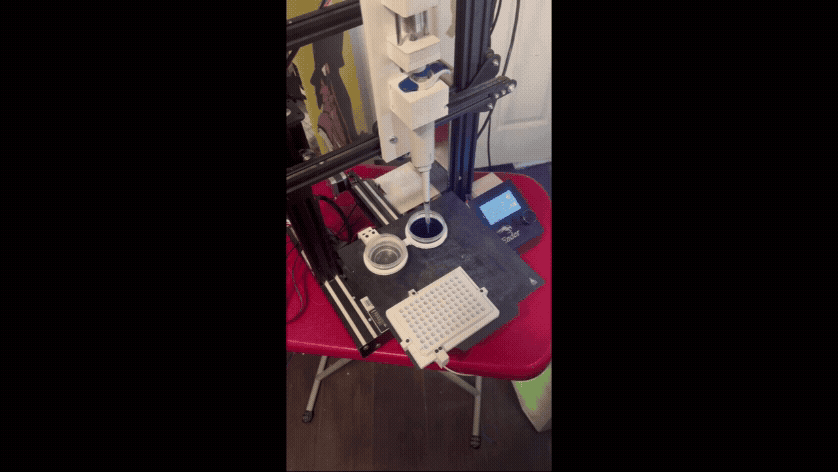
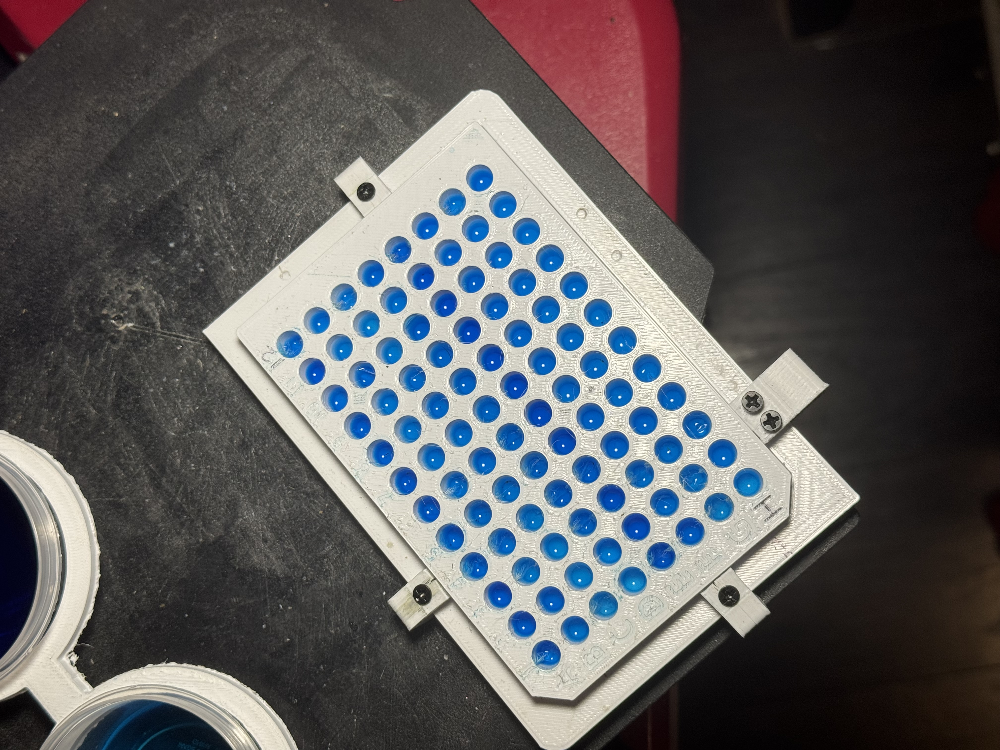

## License

Software: [Apache 2.0](https://www.apache.org/licenses/LICENSE-2.0)

Mechanical design: [Creative Commons Attribution 4.0 International](http://creativecommons.org/licenses/by/4.0/)

[](http://creativecommons.org/licenses/by/4.0/)
---
# Modular, Remotely Accessible, Open Source Liquid Handler — Ender 3 Pro


### This project showcases a fully functional, network/remote-access capable liquid handler built by modifying a used Ender 3 Pro 3D printer for **under $150**.

## Features
- **Low Cost** —
  - Base build under $150 using a used/refurbished Ender 3 Pro; accessible without institutional funding
- **Modular Hardware** —
  - Built on a widely-supported 3D printer platform running open-source Marlin firmware; components are replaceable and the design is forkable

- **Precise, Calibrated Dispensing** —
  - semi-automated gravimetric calibration workflow CV% tracked as a primary acceptance metric  following ISO 8655 gravimetric principles
  - Well alignment, pipette well and reservoir immersion tests
- **Network Connectivity** —
  - Full remote operation via OctoPrint + OctoEverywhere plugin: file uploads, G-code terminal, protocol monitoring, and calibration runs without physical access
- **Flexible Scripting** —
  - Gcode generating scripts can be utilized to make simple, customizable, lab protocols in workflows
- **Demonstrated Application** —
  - 24-column, 4-step 1:2 serial dilution protocol across a full 96-well plate in a 2-hour automated run
---
## Current Validation Results
| Metric | Value |
|---|---|
| Target Volume | 125.0 µL |
| Mean Volume | 126.85 µL |
| Mean Error | +1.85 µL (+1.48%) |
| Standard Deviation | 4.10 µL |
| CV | 3.23% |
| Trial Count | 10 |
---
## Table of Contents
- [License](#license)
- [Current Validation Results](#current-validation-results)
- [Build Resources](#build-resources)
  - [BOM(Bill of Materials)](#bom-bill-of-materials)
  - [CAD](#cad)
- [Software & Plugins](#software--plugins)
- [Repository Structure](#repository-structure)
- [Calibration](#calibration)
- [Serial Dilution Protocol](#serial-dilution-protocol)
- [Checklist / Roadmap](#checklist--roadmap)

---

## Build Resources

### Bill of Materials(BOM)

**Base build cost: ~$130**

|Main Base Items| Category  | Notes |
|---|---|---|
|**Creality Ender 3 Pro (used/refurbished)** | Motion platform | XYZ gantry + E-axis repurposed for plunger actuation |
| **Four E's Scientific P1000 single-channel manual pipette** | Pipette | Set to 125µL; drives through plunger stops via actuator |
|**Custom 3D-printed clamps, well plate holder, reservoir holders** |Deck hardware| STL files included in `/STL` |
|**Raspberry Pi (OctoPrint host)** | Networking, Remote Monitoring |  Enables remote network operation |

Full BOM with sourcing notes: [`References/BOM.csv`](References/BOM.csv)

---

### CAD

All custom parts are designed in Autodesk Fusion. Source files are in `/CAD`; 
- print-ready STLs are in `/STL_files`
- modifiable F3D files are in `F3D_files`

| Component  | STL file | F3D file |
|---|---|---|
| Liquid handler arm mount | [`lh_arm_mount_i1.stl`]( CAD/STL_files/lh_arm_mount_i1.stl)|[`lh_arm_mount_i1.f3d`](CAD/F3D_files/lh_arm_mount_i1.f3d) |
| actuator plunger push plate | [`plunger_push_plate_i4.stl`]( CAD/STL_files/plunger_push_plate_i4.stl)|[`plunger_push_plate_i4.f3d`](CAD/F3D_files/plunger_push_plate_i4.f3d) |
| Pipette mount | [`pipette_mount_i2.stl`]( CAD/STL_files/pipette_mount_i2.stl)|[`pipette_mount_i2.f3d`](CAD/F3D_files/pipette_mount_i2.f3d) |
| 96-well plate deck|[`96_wp_deck_i2.stl`](/CAD/STL_files/96_wp_deck_i2.stl)| [`96_wp_deck_i2.f3d`](/CAD/F3D_files/96_wp_deck_i2.f3d)|
| vwr cell culture 96-well plate deck|[`vwr_96_wp_deck_i2.stl`](/CAD/STL_files/vwr_96_wp_deck_i2.stl)| [`vwr_96_wp_deck_i2.f3d`](/CAD/F3D_files/vwr_96_wp_deck_i2.f3d)|
| Reservoir holder |[`dual_holder_minicups_i1.stl`](/CAD/STL_files/dual_holder_minicups_i1.stl) | [`dual_holder_minicups_i1.f3d`](/CAD/F3D_files/dual_holder_minicups_i1.f3d) |
| Deck2Plate clamps |[`deck2plateClamp_I1.stl`](CAD/STL_files/deck2plateClamp_I1.stl)|[`deck2plateClamp_I1.f3d`](/CAD/F3D_files/deck2plateclamp_i1.f3d)|
| Deck2Bed clamps |[`deck2bedClamp_i1.stl`](CAD/STL_files/deck2bedClamp_i1.stl)|[`deck2bedClamp_i1.f3d`](/CAD/F3D_files/deck2bedClamp_i1.f3d)|
| Reservoir2Deck adapter clamp |[`res2deckClamp_i3.stl`](CAD/STL_files/res2deckClamp_i3.stl)|[`res2deckClamp_i3.f3d`](/CAD/F3D_files/res2deckClamp_i3.f3d)|

---

## Software & Plugins

### OctoPrint

OctoPrint runs on a Raspberry Pi connected to the printer's control board, enabling full remote operation — file management, G-code terminal, print monitoring, and protocol execution without physical access to the machine.

Setup guide: [OctoPrint on Raspberry Pi (YouTube)](https://www.youtube.com/watch?v=9FYqQdan-lA)

### Plugins

| Plugin | Purpose | Link |
|---|---|---|
| Creality 2x Temperature Reporting Fix | Corrects erroneous temperature doubling on Ender 3 boards | [Plugin page](https://plugins.octoprint.org/plugins/ender3v2tempfix/) |
| OctoEverywhere | Secure remote access — no port forwarding required; connection is handled through the OctoEverywhere service | [Plugin page](https://plugins.octoprint.org/plugins/octoeverywhere/) |

---
## Repository Structure
```
ModularLiquidHandler-Ender3/
├── CAD/
├── STL/
├── Code/
│   ├── Tests/
│   │   ├── gc_test.py
│   │   └── gc_calibration.py
│   ├── solvent_fill.py
│   └── serial_dilution.py
├── References/
│   └── BOM.csv
└── README.md
```
## Calibration

- Z-height was calibrated using Pronterface and G92 Z0.
- E-axis positions corresponding to the pipette's upper, first, and second stops were determined empirically using gravimetric validation.

### Gravimetric Calibration

Pipette accuracy is validated by measuring dispensed water mass and converting to volume. Water density at NTP (0.998 g/mL) is used for the conversion. CV% is the primary acceptance metric per ISO 8655.

**Step 1 — Generate test G-code**

```bash
python gc_test.py
```

- Outputs `test_col_row_calibration.gcode`. Runs `TRIAL_NUM` aspirate/dispense cycles (default: 5), pausing after each dispense for scale reading via M0 host pause.

**Step 2 — Run the protocol**

- Load G-code via Octoprint or Pronterface. During each trial, tare the scale during the first pause and record mass of the dispensed liquid to `raw_data.txt` (one reading per line) during the second.

**Step 3 — Analyze results**

```bash
python gc_calibration.py raw_data.txt
```

Options:
- `--target-ul` — target transfer volume in µL (default: 125.0)
- `--output-dir` — output directory (default: `results/`)
- `--keep-raw` — do not clear raw data file after analysis

- Outputs a CSV with per-trial transfer mass, volume, and error, plus a summary `.txt` with average volume, standard deviation, CV%, and mean error against target.

**Step 4 — Iterate**

Adjust `E_FIRST_STOP` / `E_SECOND_STOP` based on mean error and re-run until CV and accuracy are within acceptable range.

---

## Serial Dilution Protocol

Serial dilution is a foundational technique across molecular assays — including titer concentration curves in ELISA, library preparation for NGS, and reagent standardization. This protocol demonstrates the liquid handler running a 24-column, 4-step 1:2 serial dilution across a full 96-well plate in a 2-hour automated run.



**Step 1 — Verify Calibration Constants**

Confirm `E_FIRST_STOP`, `E_SECOND_STOP`, and Z-height values are current before running any protocol.

**Step 2 — Fill Wells with Solvent**

- Add solvent reservoir with 50 mL H₂O
- Run: `python solvent_fill.py`
- Load and run: `solvent_fill_prot.gcode`

**Step 3 — Run Serial Dilution**

- Replace solvent reservoir with empty waste reservoir
- Add stock reservoir in second slot (40 mL + 20 drops blue dye)
- Run: `python serial_dilution.py`
- Load and run: `24_4_1n2_sd_prot.gcode`


## Checklist / Roadmap

- [x] Single-channel syringe pump build
- [x] 96-well plate deck with custom clamp system
- [x] Semi-automated gravimetric calibration workflow
- [x] 24-column 4-step 1:2 serial dilution demonstration
- [x] OctoPrint + OctoEverywhere network integration
- [ ] RPi camera-based tip detection and alignment
- [ ] Parametric reservoir holder generating script for simplified custom STL holder generation
- [ ] Multi-channel head expansion
- [ ] Full protocol scripting interface

---

