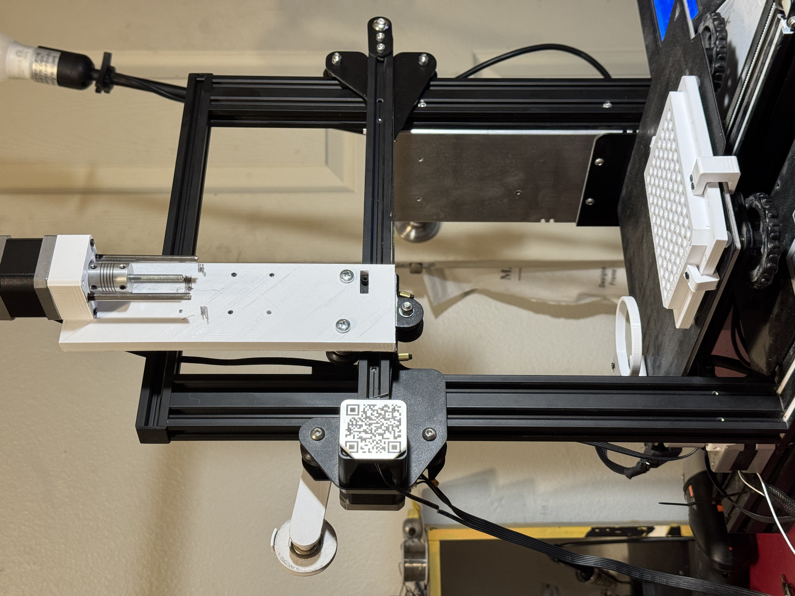

# Modular Liquid Handler — from 3D Printer Modification (Ender 3 Pro Base)


A **low-cost**, **open-source** liquid handler built by modifying an Ender 3 Pro 3D printer. The base build costs **under $150** and supports single-channel pipetting to a 96-well plate format with semi-automated gravimetric calibration following ISO 8655 methodology.

Built as a hands-on educational project to deepen practical understanding of laboratory automation, linear actuator mechanics, and calibration workflows.

---

## Hardware Overview



The core modification replaces the Ender 3's extruder with a manual pipette mounted  with an actuator on the X-axis carriage. The printer's existing motion system handles X/Y positioning; a custom Z-axis height and E-axis (extruder stepper) movement drives the actuator for pipette aspiration and dispensing.

**Key design decisions:**

- **Linear Actuator use** — built first as a standalone unit to understand linear actuator mechanics before integration. Mount design adapted from published open-source lab automation work with a modified push plate to fit P1000 manual pipette.
- **Well plate deck** — the stock printer bed has low friction, causing well plate drift during protocol runs from repeated tip impacts. Custom clamps were designed and iterated to secure customly designed 96-well plate deck and reservoir holders rigidly to the bed.
- **Pipette** — standard manual P1000 single-channel pipette. The actuator drives the plunger through its three mechanical stops (upper stop, soft stop, hard stop) under G-code control.
- **Design and Operate a 24 4 1:2 Serial Dilution protocol** to showcase application.


**Planned expansion:** Raspberry Pi + OctoPrint integration for network control and RPi camera-based automation (in development).

---

## Bill of Materials

Base build cost: ~$125

| Category | Item | Notes |
|---|---|---|
| Motion platform | Ender 3 Pro (used/refurbished) | Core motion system |
| Pipette | Single-channel manual pipette | Drives through plunger stops |
| Deck hardware | Custom 3D-printed clamps, well plate holder, reservoir holder | STL files included |
| Electronics | Arduino Uno | G-code via Pronterface or SD card |
| Misc | M3/M5 hardware, 1.5m stepper cable | See BOM.csv for full sourcing |

Full BOM with sourcing notes: [`References/BOM.csv`](References/BOM.csv)

---

## Calibration

### Z-Height Calibration

Z-height calibration is performed once using Pronterface for live G-code interaction:

1. Query current absolute position with `M114`
2. Navigate to a position above any well using the reported coordinates
3. Lower Z until the pipette tip is ~1–3 mm above the well surface
4. Run `G92 Z0` to set this as the Z origin

This Z origin is then used as the reference for all protocol Z values (`STANDBY_Z`, `IMMERSE_Z`, `HOVER_Z`).

### E-Axis (Pipette Stop) Calibration

Manual pipettes have three mechanical stops:

- **Upper stop (zero stop)** — plunger at rest
- **Soft stop (first stop)** — normal aspiration volume
- **Hard stop (second stop)** — blow-out position

Unlike manual operation where stops are felt by resistance, the stepper actuator requires empirical calibration. The approach:

1. Estimate the soft stop E distance by measuring plunger height manually
2. Use Pronterface to find the E value where the push plate reaches zero stop, and the distance from soft stop to hard stop
3. Update `E_ZERO_STOP`, `E_FIRST_STOP`, `E_SECOND_STOP` constants in `gc_volume_test.py`
4. Validate with gravimetric calibration (see below)

---

## Gravimetric Calibration

Pipette accuracy is validated using gravimetric calibration — measuring the mass of dispensed water and converting to volume. Water density at NTP (0.998 g/mL) is used for conversion. This follows ISO 8655 methodology; CV% is the primary acceptance metric.

### Workflow

**Step 1 — Generate test G-code**

```bash
python gc_volume_test.py
```

Outputs `test_col_row_calibration.gcode`. The protocol runs `TRIAL_NUM` (default: 5) aspirate/dispense cycles, pausing after each dispense with an M117 display prompt and M0 host pause to allow scale reading.

**Step 2 — Run the protocol**

Load the G-code via SD card or Pronterface. After each M0 pause, weigh the dispensed liquid and record the cumulative mass to `raw_data.txt` (one reading per line).

**Step 3 — Analyze results**

```bash
python gc_calibration.py raw_data.txt
```

Options:
- `--target-ul` — target transfer volume in µL (default: 125.0)
- `--output-dir` — output directory (default: `results/`)
- `--keep-raw` — do not clear raw data file after analysis

Outputs a CSV with per-trial transfer mass, volume, and error, plus a summary `.txt` with average volume, standard deviation, CV%, and mean error against target.

**Step 4 — Iterate**

Adjust `E_FIRST_STOP` / `E_SECOND_STOP` values based on mean error and re-run until CV and accuracy are within acceptable range.

---
## Running Serial Dilution Proctocol


- Serial Dilution is a critical component in molecular assays, including multiplexing in NGS  Assay and titer concentration curves in ELISA, utilized in diagnostic, clinical, research, and industry


**Step 1 — Ensure Calibration tests and Constants**

**Step 2 — Add Solvent to  Wells**
- Add solvent reservoir with 50mL of H2O
- run solvent_fill.py
- load and print solvent_fill_prot.gcode


**Step 3 — Run Serial Dilution**
- replace solvent reservoir  with empty waste reservoir
- add stock reservoir in second slot - add 40 mL and 20 drops of blue dye
- run serial_dilution.py
- load and print 24_4_1n2_sd_prot.gcode


---

## Repository Structure-(files referred shown)

```
ModularLiquidHandler-Ender3/
├── CAD/                  # AutoDesk Fusion source files
├── STL/                  # Print-ready STL files for all custom parts
├── Code/
│   ├── gc_volume_test.py     # Generates gravimetric calibration G-code
│   └── gc_calibration.py     # Analyzes raw mass data, outputs CSV + summary
├── References/
│   ├── BOM.csv               # Full bill of materials with sourcing
│   └── ...
└── README.md
```

---

## Roadmap

- [x] Single-channel syringe pump build
- [x] 96-well plate deck with custom clamp system
- [x] Semi-automated gravimetric calibration workflow
- [x] Demo 24 4 1:2 serial dilution application
- [ ] Raspberry Pi + OctoPrint network integration
- [ ] RPi camera-based tip detection and alignment
- [ ] create reservoir container class to make STLs for custom mount holders simple
- [ ] Multi-channel head expansion
- [ ] Full protocol scripting interface

---

## License

MIT
